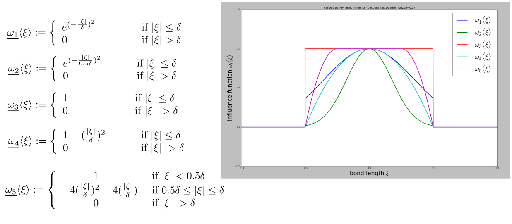
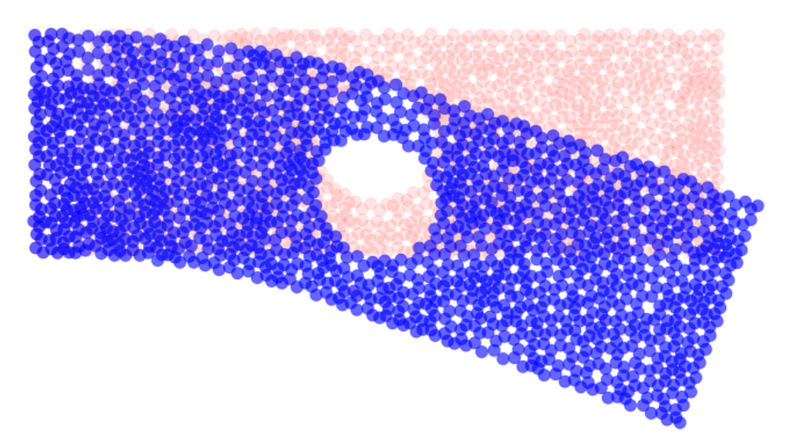
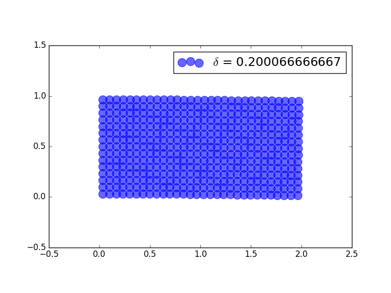

Peridynamics offers a new methodology for modelling solid mechanics problems using the idea of interactions of a point with the neigboring points and is a different framework compared to the classical continuum mechanics that is being used most widely. 

This project aims to develop a (linear?) peridynamics solver (and also constites the part of masters thesis of Gajendra supervised by PhD scholar Felix Bott at the Technical University of Munich)

## The code has the following features:

#### Two choices of material model namely 
* Constitutive material model 
* Correspondence material model.

#### Choices of influence functions namely 
* Standard gaussian influence function (Omega_1)
* Narrow gaussian influence function (Omega_2)
* Unit-Step influence function (Omega_3)
* Parabolic influcene function (Omega_4)
* Peridigm-like parabolic function (Omega_5)

#### Choices of solution  : static and dynamic (see image/animation below)
* static bending of a 2D and 3D plate (only a 2D example shown below)

* dynamic fracture of 2D plate

